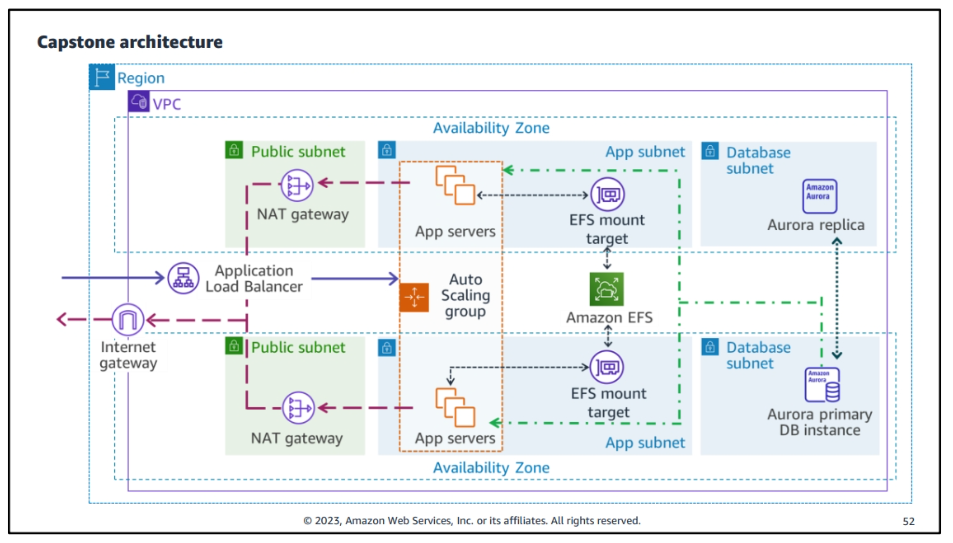

# AWS Certified Solutions Architect

Working toward building the Capstone architecture.

**Target Architecture**



**Current Architecture**


## Prerequisites

If you want to provision the example architecture into your own AWS Account, be sure to install the prerequisite tools listed below.

- [AWS CLI v2](https://docs.aws.amazon.com/cli/latest/userguide/getting-started-install.html)
- [Terraform CLI](https://developer.hashicorp.com/terraform/downloads)

## Running the example

> Note that all below commands require AWS credentials. You can either [configure your AWS CLI](https://docs.aws.amazon.com/cli/latest/userguide/cli-chap-configure.html) instance using access/secret keys or profiles, or you can make use of the [AWS Vault](https://github.com/99designs/aws-vault).

Before running, make sure the local Terraform state is initialized and all modules installed.

```shell
$ make init
```

Then to provision the changes, run the following:

```shell
$ make apply
```

It is recommended that you destroy the resources once you are finished, so that you don't incur undesired costs. To do this, run the following:

```shell
$ make destroy
```
