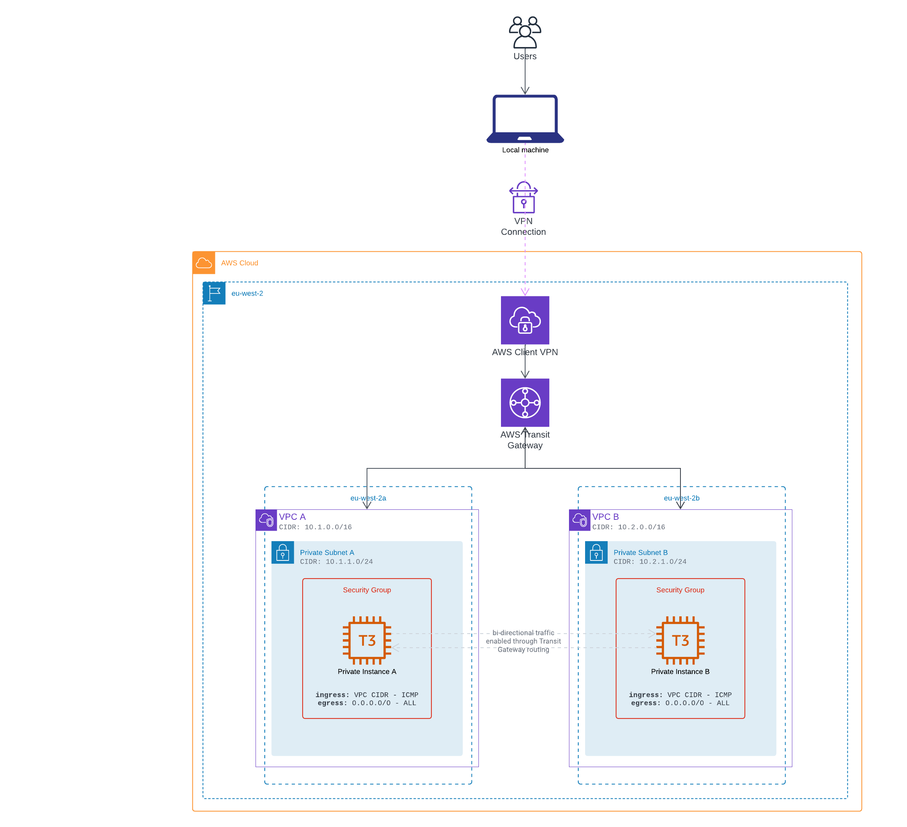

# Transit Gateway

Provisions two VPCs within a single Region that are connected by a Transit Gateway. Each VPC contains 1 private Subnet with a single EC2 Instance. The Transit Gateway routes traffic along the private network to allow both VPCs to communicate with one another. A Client VPN is also set up within the account to allow local connectivity into the cloud-based private network. Both EC2 Instances are accessible via AWS Systems Manager Session Manager.

**Architecture**



## Running the example

> Note that all below commands require AWS credentials. You can either [configure your AWS CLI](https://docs.aws.amazon.com/cli/latest/userguide/cli-chap-configure.html) instance using access/secret keys or profiles, or you can make use of the [AWS Vault](https://github.com/99designs/aws-vault).

Before running, make sure the local Terraform state is initialized and all modules installed.

```shell
$ make init
```

Then to provision the changes, run the following:

```shell
$ make apply
```

It is recommended that you destroy the resources once you are finished, so that you don't incur undesired costs. To do this, run the following:

```shell
$ make destroy
```
